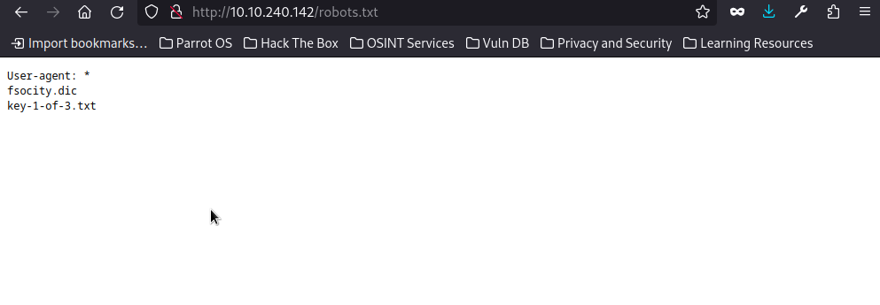
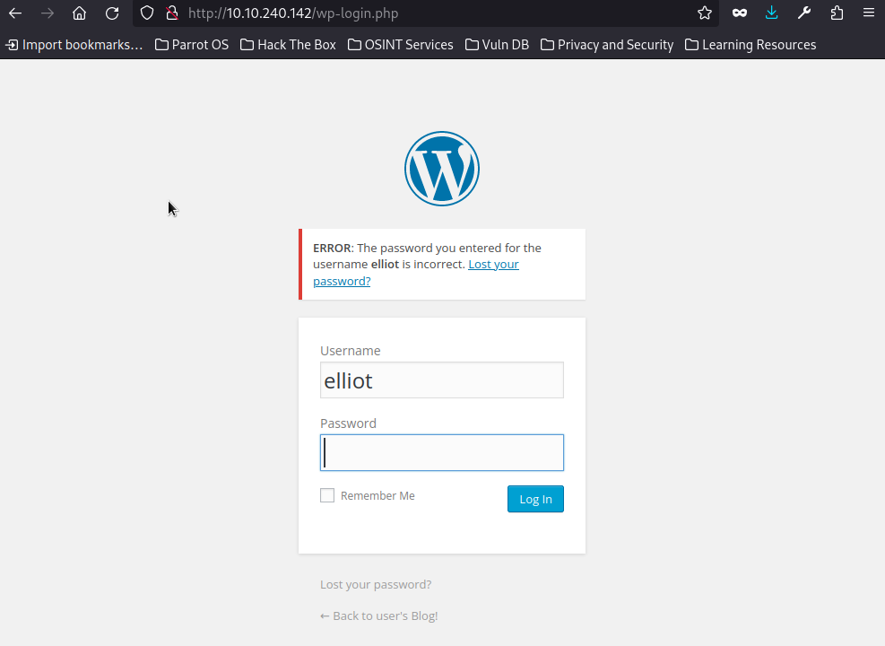

[Link to room on TryHackMe.com](https://tryhackme.com/r/room/0day)


Hello friend, welcome to my MrRobot WriteUp! MrRobot is one of the best shows i have ever watched. In this writeup i am gonna show you how i did solve this ctf. So first we start with the enumeration with rustscan and nmap:


```
┌─[root@parrot]─[/home/parrot]
└──╼ #rustscan -a 10.10.240.142
.----. .-. .-. .----..---.  .----. .---.   .--.  .-. .-.
| {}  }| { } |{ {__ {_   _}{ {__  /  ___} / {} \ |  `| |
| .-. \| {_} |.-._} } | |  .-._} }\     }/  /\  \| |\  |
`-' `-'`-----'`----'  `-'  `----'  `---' `-'  `-'`-' `-'
The Modern Day Port Scanner.
________________________________________
: http://discord.skerritt.blog         :
: https://github.com/RustScan/RustScan :
 --------------------------------------
Scanning ports like it's my full-time job. Wait, it is.

[~] The config file is expected to be at "/root/.rustscan.toml"
[!] File limit is lower than default batch size. Consider upping with --ulimit. May cause harm to sensitive servers
[!] Your file limit is very small, which negatively impacts RustScan's speed. Use the Docker image, or up the Ulimit with '--ulimit 5000'. 
Open 10.10.240.142:80
Open 10.10.240.142:443
[~] Starting Script(s)
[~] Starting Nmap 7.94SVN ( https://nmap.org ) at 2024-05-07 00:31 +03
Initiating Ping Scan at 00:31
Scanning 10.10.240.142 [4 ports]
Completed Ping Scan at 00:31, 1.42s elapsed (1 total hosts)
Initiating Parallel DNS resolution of 1 host. at 00:31
Completed Parallel DNS resolution of 1 host. at 00:31, 2.18s elapsed
DNS resolution of 1 IPs took 2.18s. Mode: Async [#: 1, OK: 0, NX: 1, DR: 0, SF: 0, TR: 1, CN: 0]
Initiating SYN Stealth Scan at 00:31
Scanning 10.10.240.142 [2 ports]
Discovered open port 443/tcp on 10.10.240.142
Discovered open port 80/tcp on 10.10.240.142
Completed SYN Stealth Scan at 00:31, 2.62s elapsed (2 total ports)
Nmap scan report for 10.10.240.142
Host is up, received echo-reply ttl 60 (1.7s latency).
Scanned at 2024-05-07 00:31:17 +03 for 2s

PORT    STATE SERVICE REASON
80/tcp  open  http    syn-ack ttl 60
443/tcp open  https   syn-ack ttl 60

Read data files from: /usr/bin/../share/nmap
Nmap done: 1 IP address (1 host up) scanned in 6.31 seconds
           Raw packets sent: 6 (240B) | Rcvd: 128 (29.816KB)
```


```
┌─[root@parrot]─[/home/parrot]
└──╼ #nmap -sC -sV -A -Pn -p 80,443 10.10.240.142
Starting Nmap 7.94SVN ( https://nmap.org ) at 2024-05-07 00:36 +03
Nmap scan report for 10.10.240.142
Host is up (0.49s latency).
Not shown: 997 filtered tcp ports (no-response)
PORT    STATE  SERVICE  VERSION
80/tcp  open   http     Apache httpd
|_http-server-header: Apache
|_http-title: Site doesn't have a title (text/html).
443/tcp open   ssl/http Apache httpd
| ssl-cert: Subject: commonName=www.example.com
| Not valid before: 2015-09-16T10:45:03
|_Not valid after:  2025-09-13T10:45:03
|_http-server-header: Apache
|_http-title: Site doesn't have a title (text/html).
Aggressive OS guesses: Linux 3.10 - 3.13 (89%), Linux 5.4 (89%), Linux 3.10 - 4.11 (88%), Linux 3.13 (88%), Linux 3.13 or 4.2 (88%), Linux 3.2 - 3.8 (88%), Linux 4.2 (88%), Linux 4.4 (88%), Linux 3.12 (87%), Linux 3.16 (87%)
No exact OS matches for host (test conditions non-ideal).
Network Distance: 5 hops

TRACEROUTE (using port 22/tcp)
HOP RTT       ADDRESS
1   505.89 ms 10.17.0.1
2   ... 4
5   760.23 ms 10.10.240.142

OS and Service detection performed. Please report any incorrect results at https://nmap.org/submit/ .
Nmap done: 1 IP address (1 host up) scanned in 163.35 seconds
```


So we see only to ports are open end with this services and the versions we cant do something useful. We keep enumeration on port 80 with gobuster:


```
gobuster dir -u http://10.10.240.142 -w common.txt -x php,html,txt,old,cgi
===============================================================
Gobuster v3.6
by OJ Reeves (@TheColonial) & Christian Mehlmauer (@firefart)
===============================================================
[+] Url:                     http://10.10.240.142
[+] Method:                  GET
[+] Threads:                 10
[+] Wordlist:                common.txt
[+] Negative Status codes:   404
[+] User Agent:              gobuster/3.6
[+] Extensions:              php,html,txt,old,cgi
[+] Timeout:                 10s
===============================================================
Starting gobuster in directory enumeration mode
===============================================================
/.html                (Status: 403) [Size: 214]
/.hta                 (Status: 403) [Size: 213]
/.hta.txt             (Status: 403) [Size: 217]
/.hta.old             (Status: 403) [Size: 217]
/.hta.cgi             (Status: 403) [Size: 217]
/.hta.php             (Status: 403) [Size: 217]
/.hta.html            (Status: 403) [Size: 218]
/.htaccess            (Status: 403) [Size: 218]
/.htaccess.html       (Status: 403) [Size: 223]
/.htaccess.php        (Status: 403) [Size: 222]
/.htaccess.txt        (Status: 403) [Size: 222]
/.htaccess.old        (Status: 403) [Size: 222]
/.htaccess.cgi        (Status: 403) [Size: 222]
/.htpasswd            (Status: 403) [Size: 218]
/.htpasswd.txt        (Status: 403) [Size: 222]
/.htpasswd.old        (Status: 403) [Size: 222]
/.htpasswd.cgi        (Status: 403) [Size: 222]
/.htpasswd.php        (Status: 403) [Size: 222]
/.htpasswd.html       (Status: 403) [Size: 223]
Progress: 709 / 27690 (2.56%)[ERROR] context deadline exceeded (Client.Timeout or context cancellation while reading body)
[ERROR] context deadline exceeded (Client.Timeout or context cancellation while reading body)
/0                    (Status: 301) [Size: 0] [--> http://10.10.240.142/0/]
/admin                (Status: 301) [Size: 235] [--> http://10.10.240.142/admin/]
/atom                 (Status: 301) [Size: 0] [--> http://10.10.240.142/feed/atom/]
/audio                (Status: 301) [Size: 235] [--> http://10.10.240.142/audio/]
/blog                 (Status: 301) [Size: 234] [--> http://10.10.240.142/blog/]
/cgi-bin/.html        (Status: 403) [Size: 222]
/css                  (Status: 301) [Size: 233] [--> http://10.10.240.142/css/]
/dashboard            (Status: 302) [Size: 0] [--> http://10.10.240.142/wp-admin/]
/favicon.ico          (Status: 200) [Size: 0]
/feed                 (Status: 301) [Size: 0] [--> http://10.10.240.142/feed/]
/image                (Status: 301) [Size: 0] [--> http://10.10.240.142/image/]
/Image                (Status: 301) [Size: 0] [--> http://10.10.240.142/Image/]
/images               (Status: 301) [Size: 236] [--> http://10.10.240.142/images/]
/index.php            (Status: 301) [Size: 0] [--> http://10.10.240.142/]
/index.html           (Status: 200) [Size: 1188]
/index.html           (Status: 200) [Size: 1188]
/index.php            (Status: 301) [Size: 0] [--> http://10.10.240.142/]
Progress: 12692 / 27690 (45.84%)[ERROR] context deadline exceeded (Client.Timeout or context cancellation while reading body)
/js                   (Status: 301) [Size: 232] [--> http://10.10.240.142/js/]
/license              (Status: 200) [Size: 309]
/license.txt          (Status: 200) [Size: 309]
/login                (Status: 302) [Size: 0] [--> http://10.10.240.142/wp-login.php]
/page1                (Status: 301) [Size: 0] [--> http://10.10.240.142/]
/phpmyadmin           (Status: 403) [Size: 94]
/rdf                  (Status: 301) [Size: 0] [--> http://10.10.240.142/feed/rdf/]
/readme               (Status: 200) [Size: 64]
/readme.html          (Status: 200) [Size: 64]
/robots               (Status: 200) [Size: 41]
/robots.txt           (Status: 200) [Size: 41]
/robots.txt           (Status: 200) [Size: 41]
/rss                  (Status: 301) [Size: 0] [--> http://10.10.240.142/feed/]
/rss2                 (Status: 301) [Size: 0] [--> http://10.10.240.142/feed/]
/sitemap              (Status: 200) [Size: 0]
/sitemap.xml          (Status: 200) [Size: 0]
/video                (Status: 301) [Size: 235] [--> http://10.10.240.142/video/]
/wp-admin             (Status: 301) [Size: 238] [--> http://10.10.240.142/wp-admin/]
/wp-app.php           (Status: 403) [Size: 0]
/wp-atom.php          (Status: 301) [Size: 0] [--> http://10.10.240.142/feed/atom/]
/wp-commentsrss2.php  (Status: 301) [Size: 0] [--> http://10.10.240.142/comments/feed/]
/wp-config.php        (Status: 200) [Size: 0]
/wp-config            (Status: 200) [Size: 0]
/wp-content           (Status: 301) [Size: 240] [--> http://10.10.240.142/wp-content/]
/wp-cron.php          (Status: 200) [Size: 0]
/wp-cron              (Status: 200) [Size: 0]
/wp-feed.php          (Status: 301) [Size: 0] [--> http://10.10.240.142/feed/]
/wp-includes          (Status: 301) [Size: 241] [--> http://10.10.240.142/wp-includes/]
/wp-links-opml        (Status: 200) [Size: 227]
/wp-load              (Status: 200) [Size: 0]
/wp-links-opml.php    (Status: 200) [Size: 227]
/wp-load.php          (Status: 200) [Size: 0]
/wp-login             (Status: 200) [Size: 2671]
/wp-login.php         (Status: 200) [Size: 2671]
/wp-mail              (Status: 500) [Size: 3064]
/wp-mail.php          (Status: 500) [Size: 3025]
/wp-rdf.php           (Status: 301) [Size: 0] [--> http://10.10.240.142/feed/rdf/]
/wp-register.php      (Status: 301) [Size: 0] [--> http://10.10.240.142/wp-login.php?action=register]
/wp-rss.php           (Status: 301) [Size: 0] [--> http://10.10.240.142/feed/]
/wp-rss2.php          (Status: 301) [Size: 0] [--> http://10.10.240.142/feed/]
/wp-settings          (Status: 500) [Size: 0]
/wp-settings.php      (Status: 500) [Size: 0]
/wp-signup            (Status: 302) [Size: 0] [--> http://10.10.240.142/wp-login.php?action=register]
/wp-signup.php        (Status: 302) [Size: 0] [--> http://10.10.240.142/wp-login.php?action=register]
/xmlrpc.php           (Status: 405) [Size: 42]
/xmlrpc               (Status: 405) [Size: 42]
/xmlrpc.php           (Status: 405) [Size: 42]
Progress: 27684 / 27690 (99.98%)
===============================================================
Finished
===============================================================
```


And then we see some directories when we go to the website a cool terminal welcomes us:


when we use the commands we dont get something useful. So we decide to look at the robots.txt file and there is really important infos:





in the http://10.10.240.142/key-1-of-3.txt we get our first flag. And in the same location fsocity.dic file is a very long wordlist when we look at the second flag hint it says: There's something fishy about this wordlist... Why is it so long?  so i when we look inside of the file there is so much words repeates and most of them is very short so we guess its a password list so we should find the login page and username and we should make fsocity.dic file shorter. In gobuster we saw /login directory when we go the page we see its a wordpress login page:


So there is a useful flaw in the site it says the invalid usernames. We see there is no user named admin according to we are in the MrRobot Ctf when we try elliot as username we receive a different message:





So now we should make our fscotiy.dic file shorter.I think our friend elliot doesn't use passwords shorter than six digits. I coded a python program that finds words does not repeat, longer than five digits and creates a new wordlist with these words.Programs source code is:


```
def main():
    input_file = 'fsocity.dic'
    output_file = 'new.txt'

    
    filtered_words = set()

    
    with open(input_file, 'r') as file:
        for line in file:
            word = line.strip()
            if len(word) > 5:
                filtered_words.add(word)

    
    with open(output_file, 'w') as file:
        for word in filtered_words:
            file.write(word + '\n')

    

if __name__ == "__main__":
    main()
```


This program makes a shorter wordlist called new.txt .But we need a another tool to start bruteforce attack on login page. This site is built with wordpress so we can use the tool caled wpscan if dont have it you can install it with this commands:


```
sudo apt-get update 
```
```
sudo apt install ruby ruby-dev 
```
```
sudo apt install gem
```
```
sudo apt install build-essential libcurl4-openssl-dev libxml2 libxml2-dev libxslt1-dev ruby-dev libgmp-dev zlib1g-dev 
```
```
sudo gem install wpscan
```
