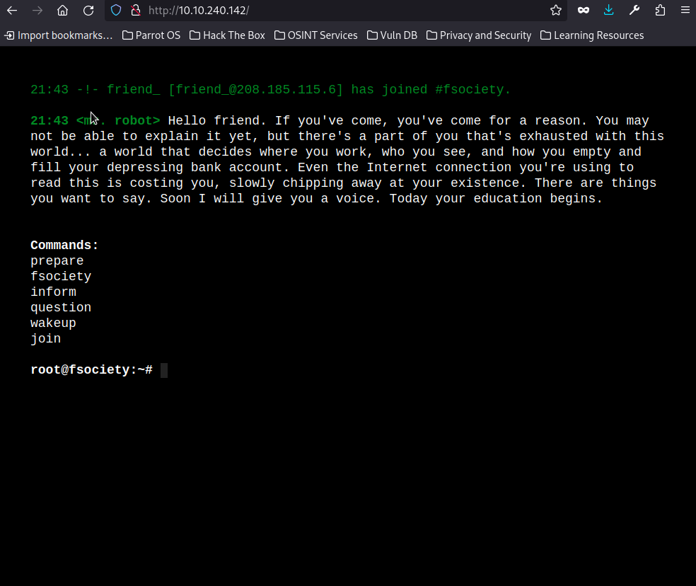

[Link to room on TryHackMe.com](https://tryhackme.com/r/room/0day)


Hello friend, welcome to my MrRobot WriteUp! MrRobot is one of the best shows i have ever watched. In this writeup i am gonna show you how i did solve this ctf. So first we start with the enumeration with rustscan and nmap:


```
┌─[root@parrot]─[/home/parrot]
└──╼ #rustscan -a 10.10.240.142
.----. .-. .-. .----..---.  .----. .---.   .--.  .-. .-.
| {}  }| { } |{ {__ {_   _}{ {__  /  ___} / {} \ |  `| |
| .-. \| {_} |.-._} } | |  .-._} }\     }/  /\  \| |\  |
`-' `-'`-----'`----'  `-'  `----'  `---' `-'  `-'`-' `-'
The Modern Day Port Scanner.
________________________________________
: http://discord.skerritt.blog         :
: https://github.com/RustScan/RustScan :
 --------------------------------------
Scanning ports like it's my full-time job. Wait, it is.

[~] The config file is expected to be at "/root/.rustscan.toml"
[!] File limit is lower than default batch size. Consider upping with --ulimit. May cause harm to sensitive servers
[!] Your file limit is very small, which negatively impacts RustScan's speed. Use the Docker image, or up the Ulimit with '--ulimit 5000'. 
Open 10.10.240.142:80
Open 10.10.240.142:443
[~] Starting Script(s)
[~] Starting Nmap 7.94SVN ( https://nmap.org ) at 2024-05-07 00:31 +03
Initiating Ping Scan at 00:31
Scanning 10.10.240.142 [4 ports]
Completed Ping Scan at 00:31, 1.42s elapsed (1 total hosts)
Initiating Parallel DNS resolution of 1 host. at 00:31
Completed Parallel DNS resolution of 1 host. at 00:31, 2.18s elapsed
DNS resolution of 1 IPs took 2.18s. Mode: Async [#: 1, OK: 0, NX: 1, DR: 0, SF: 0, TR: 1, CN: 0]
Initiating SYN Stealth Scan at 00:31
Scanning 10.10.240.142 [2 ports]
Discovered open port 443/tcp on 10.10.240.142
Discovered open port 80/tcp on 10.10.240.142
Completed SYN Stealth Scan at 00:31, 2.62s elapsed (2 total ports)
Nmap scan report for 10.10.240.142
Host is up, received echo-reply ttl 60 (1.7s latency).
Scanned at 2024-05-07 00:31:17 +03 for 2s

PORT    STATE SERVICE REASON
80/tcp  open  http    syn-ack ttl 60
443/tcp open  https   syn-ack ttl 60

Read data files from: /usr/bin/../share/nmap
Nmap done: 1 IP address (1 host up) scanned in 6.31 seconds
           Raw packets sent: 6 (240B) | Rcvd: 128 (29.816KB)
```


```
┌─[root@parrot]─[/home/parrot]
└──╼ #nmap -sC -sV -A -Pn -p 22,80 10.10.240.142
Starting Nmap 7.94SVN ( https://nmap.org ) at 2024-05-07 00:36 +03
Nmap scan report for 10.10.240.142
Host is up (0.49s latency).
Not shown: 997 filtered tcp ports (no-response)
PORT    STATE  SERVICE  VERSION
22/tcp  closed ssh
80/tcp  open   http     Apache httpd
|_http-server-header: Apache
|_http-title: Site doesn't have a title (text/html).
443/tcp open   ssl/http Apache httpd
| ssl-cert: Subject: commonName=www.example.com
| Not valid before: 2015-09-16T10:45:03
|_Not valid after:  2025-09-13T10:45:03
|_http-server-header: Apache
|_http-title: Site doesn't have a title (text/html).
Aggressive OS guesses: Linux 3.10 - 3.13 (89%), Linux 5.4 (89%), Linux 3.10 - 4.11 (88%), Linux 3.13 (88%), Linux 3.13 or 4.2 (88%), Linux 3.2 - 3.8 (88%), Linux 4.2 (88%), Linux 4.4 (88%), Linux 3.12 (87%), Linux 3.16 (87%)
No exact OS matches for host (test conditions non-ideal).
Network Distance: 5 hops

TRACEROUTE (using port 22/tcp)
HOP RTT       ADDRESS
1   505.89 ms 10.17.0.1
2   ... 4
5   760.23 ms 10.10.240.142

OS and Service detection performed. Please report any incorrect results at https://nmap.org/submit/ .
Nmap done: 1 IP address (1 host up) scanned in 163.35 seconds
```


So we see only to ports are open end with this services and the versions we cant do something useful. We keep enumeration on port 80 with gobuster:


```

```


And then we see some directories when we go to the website a cool terminal welcomes us:





when we use the commands we dont get something useful. So we decide to look at the robots.txt file and there is really important infos:


